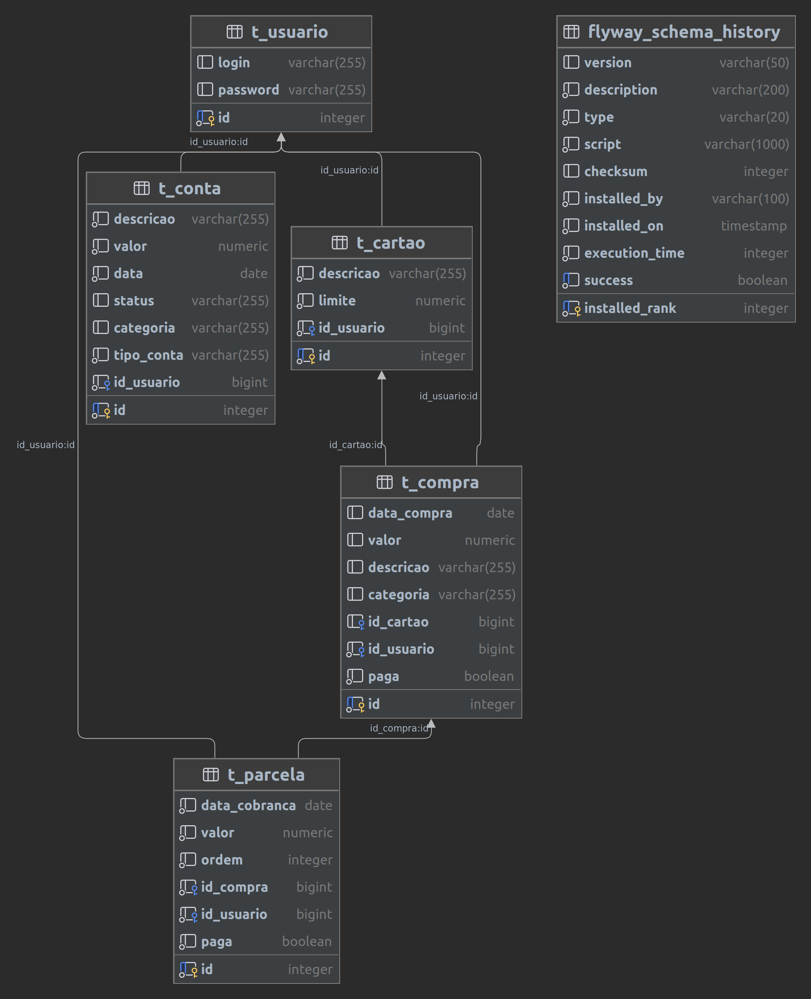

# Processo seletivo - QA

Bem vindo, candidato. 

Estamos felizes que você esteja participando do processo seletivo para a vaga de QA do Senai - Soluções Digitais.

A prova deverá utilizar as seguintes tecnologias: 
- Linguagem de programação orientada a objeto
- Banco de dados PostgreSQL
- GIT

Na etapa da entrevista deverá ser apresentado a aplicação em funcionamento.

## Instruções para a execução da prova

***O documento com o estudo de caso do que precisa ser desenvolvido será enviado por e-mail no horário previsto em edital.***

A prova será uma aplicação web dividida em backend e frontend. Você pode escolher a tecnologia que achar conveniente (PHP, JAVA, etc...).

Fica a escolha do candidato quais frameworks e servidores serão utilizados, desde que seja uma aplicação web. 

***O Banco utilizado na prova deverá ser PostgreSQL.***

Esse repositório possui apenas esse Readme com as instruções da prova. No entanto, **todo desenvolvimento deve ser commitado nesse repositório** até a data citada no edital.

Por fim, altere esse arquivo com as instruções de como poderemos testar o seu código (quais libs usar, qual servidor, etc) abaixo.

## Informações extras

- Descreva ao final deste documento (Readme.md) o detalhamento de funcionalidades implementadas, sejam elas já descritas na modelagem e / ou extras.
- Detalhar também as funcionalidades que não conseguiu implementar e o motivo.
- Caso tenha adicionado novas libs ou frameworks, descreva quais foram e porque dessa agregação.

## Tecnologias Utilizadas

- **Backend:**
    - **Rota: http://localhost:8080/**
    - **Spring Boot 3.3**
    - **Java 17**

- **Frontend:**
    - **Rota: http://localhost:4200/**
    - **Angular 18.2**
    - **TypeScript 5.5**

- **Banco de Dados:**
  - **PostgreSQL 13**

## Funcionalidades Implementadas

### Módulo Contas a Pagar

- **Cadastrar contas a pagar**
- **Listar todas as contas a pagar**
- **Editar uma conta a pagar**
- **Enviar notificação de contas a pagar**

### Módulo Contas a Receber

- **Cadastrar contas a receber**
- **Listar todas as contas a receber**
- **Editar uma conta a receber**

### Sub-módulo Cartão de Crédito

- **Cadastrar cartão de crédito**
- **Listar cartões de crédito**
- **Editar cartão de crédito**
- **Acompanhar o total de compras em aberto por cartão**

### Sub-módulo Compras do Cartão

- **Cadastrar compras para um cartão de crédito**
- **Listar compras de um cartão de crédito**
- **Editar uma compra de um cartão de crédito**

### Sub-módulo Compras Parceladas no Cartão

- **Cadastrar uma compra parcelada**
- **Listar parcelas de uma compra**
- **Editar uma compra de um cartão de crédito, alterando valor e/ou número de parcelas** (isto é refletido nas parcelas)

### Módulo de Acesso de Usuário

- **Login de usuário** (Backend com Spring Security & Frontend com tela + persistência de token)
- **Cada entidade deve pertencer a um usuário**
- **Cadastro de usuário**
- **Repassar token de acesso para todos os endpoints no Frontend**

### Módulo de Relatório (PDF ou Excel)

- **Relatório de despesas mensais por categoria** (apenas Excel e no backend)
  - para realizar a geração do relatório é necessario enviar uma requisição utilizando o seguinte curl trocando o **$token** pelo Bearer token
  - ```bash 
    curl --request GET \ --url 'http://localhost:8080/api/relatorios/despesas-mensais?formato=XLSX' \--header 'Authorization: {$token}'
    ```

## Funcionalidades Não Implementadas

### Módulo Contas a Receber

- **Criação de receitas recorrentes**, como salários

### Sub-módulo Cartão de Crédito

- **Acompanhar o limite disponível do cartão**

### Módulo de Relatório (PDF ou Excel)

- **Relatório de despesas mensais por categoria** (faltando frontend)
- **Relatório de saldo entre contas a pagar e receber**
- **Relatório de transações de cartão de crédito**
- **Gráficos de evolução do saldo ao longo do tempo**

Essas funcionalidades não foram implementadas majoritariamente devido à falta de tempo. O objetivo principal foi finalizar a maior quantidade possível das features tanto no backend quanto no frontend.

**Principais desafios e trade-offs:**

- **Desenvolvimento Frontend:** Enfrentei dificuldades significativas na criação das páginas devido à falta de experiência como desenvolvedor frontend. As páginas foram criadas principalmente para permitir o acesso às funcionalidades implementadas no backend sem a necessidade de enviar requisições manualmente.
- **Tratamento de Erros e Validações de Dados:** O tratamento de erros e as validações de dados foram áreas particularmente afetadas. A integridade do sistema foi comprometida em algumas partes devido ao tempo limitado e à necessidade de priorizar a implementação das funcionalidades principais.

A decisão de não implementar certas funcionalidades foi um trade-off para garantir que as funcionalidades principais fossem concluídas e operacionais.

## Banco de Dados

- **Banco de Dados Utilizado:** PostgreSQL 13

- **Diagrama do Banco de Dados:**


Para realizar o login, é possível utilizar um usuário já cadastrado:

- **Login:** `admin`
- **Senha:** `admin`

Para executar o projeto, é necessário estar na raiz do projeto e subir a aplicação através do docker-compose executando:
```bash
  docker-compose up --build
```
